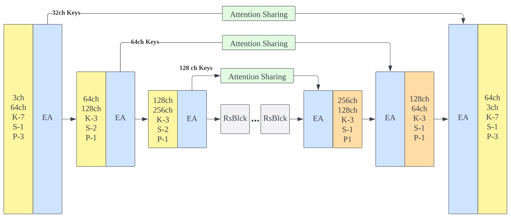
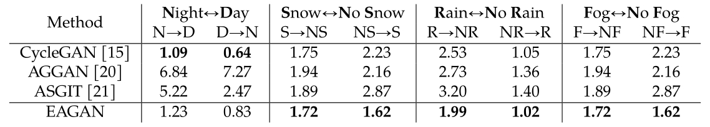
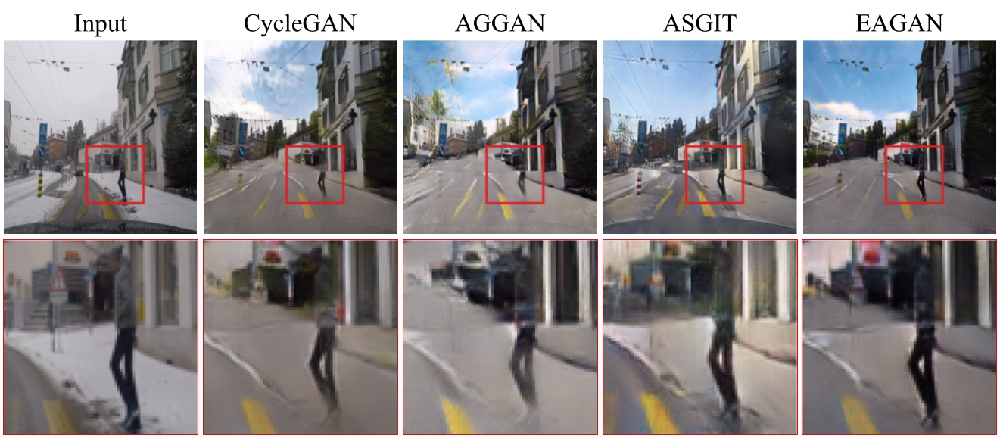
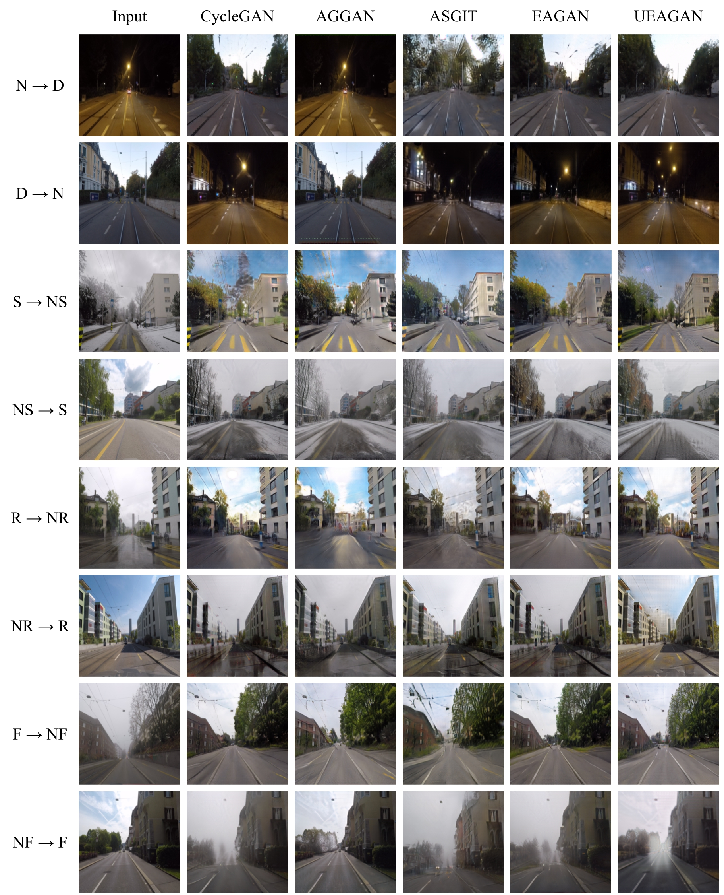
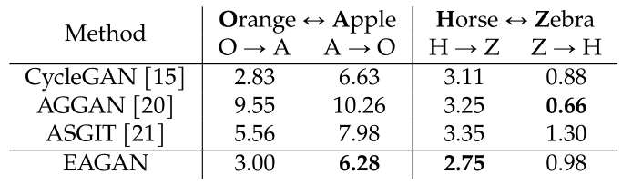
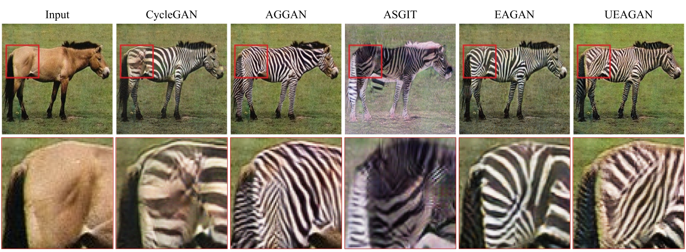
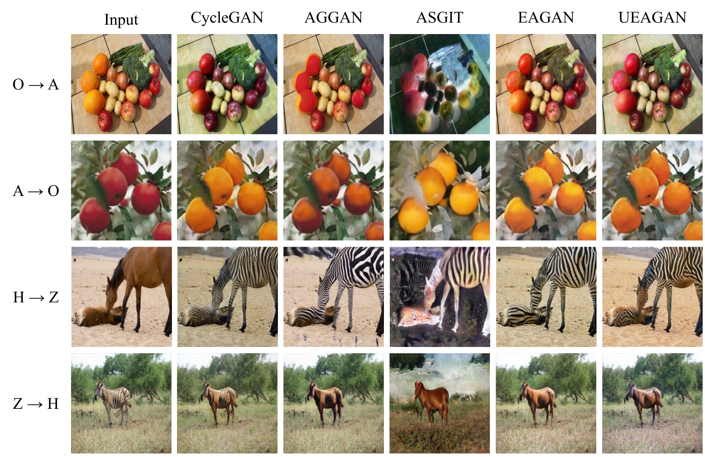
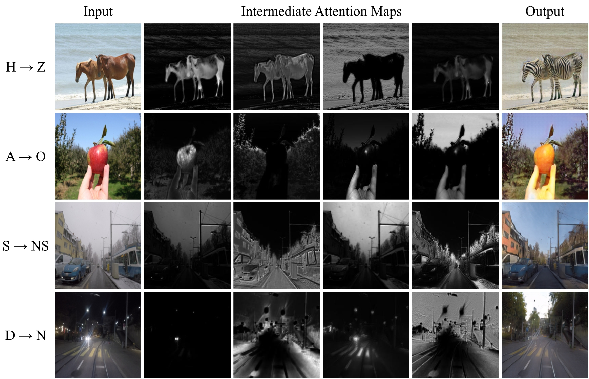

# Efficient Attention GAN (EAGAN)

This repository presents an implementations of a denominated Efficient Attention GAN for unpaired image-to-image translation.
This architectures follows the CycleGAN framework to introduce Efficient Attention blocks in the generator network of the translation process. This architecture is illustrated in the following figure. 



## Results
to evaluate and compare the performance between the proposed architecture against competing solutions, a series of models were trained from scratch on data sets for object and scenery translation. The KID score was used as the main
comparison metric.

### Scenery Comparison




### Object Comparison




### Attention-Map Visualization

An interesting aspect to observe from the trained
EAGAN model are the computed attention
maps for a given input. These maps can be observed by visualizing each channel in the Key vector from the efficient attention block. By doing so, it is possible to get an intuition of how each attention map attend to different areas of the image as observed in the following figure.



### Additional Details
For further details about the architecture, the sharing attention mechanism, and the followed methodology you can take a look at the [paper pre-print](assets/Unsupervised%20Image-to-Image%20Translation%20with%20Shared%20Efficient%20Attention%20Mechanism.pdf).
## Getting Started
### Installation

- Clone this repo:
```bash
git clone https://github.com/jccb15/efficient-attention-GAN
```

- Install [PyTorch](http://pytorch.org) and 0.4+ and other dependencies (e.g., torchvision, [visdom](https://github.com/facebookresearch/visdom) and [dominate](https://github.com/Knio/dominate)).
  - For pip users, please type the command `pip install -r requirements.txt`.
  - For Conda users, you can create a new Conda environment using `conda env create -f environment.yml`.
  - For Docker users, we provide the pre-built Docker image and Dockerfile. Please refer to our [Docker](docs/docker.md) page.
  - For Repl users, please click [](https://repl.it/github/junyanz/pytorch-CycleGAN-and-pix2pix).

### Train
- Download a CycleGAN dataset (e.g. horse2zebra):
```bash
bash ./datasets/download_cyclegan_dataset.sh horse2zebra
```
- To view training results and loss plots, run `python -m visdom.server` and click the URL http://localhost:8097.
- To log training progress and test images to W&B dashboard, set the `--use_wandb` flag with train and test script
- Train a model:
```bash
#!./scripts/train_eagan.sh
python train.py --dataroot ./datasets/horse2zebra --name horse2zebra_eagan --model cycle_gan --pool_size 50 --no_dropout --netG resnet9_eff_attn
```
To see more intermediate results, check out `./checkpoints/horse2zebra_eagan/web/index.html`.

## Acknowledgments
The present code is based in the [CycleGan](https://junyanz.github.io/CycleGAN/) implementation written by [Jun-Yan Zhu](https://github.com/junyanz) and [Taesung Park](https://github.com/taesungp), and supported by [Tongzhou Wang](https://github.com/SsnL).